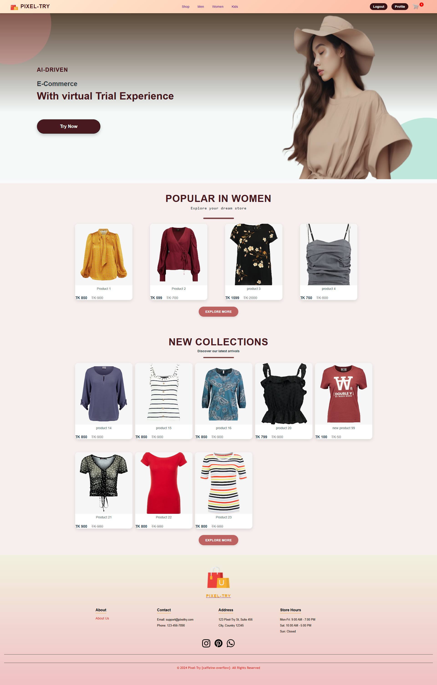
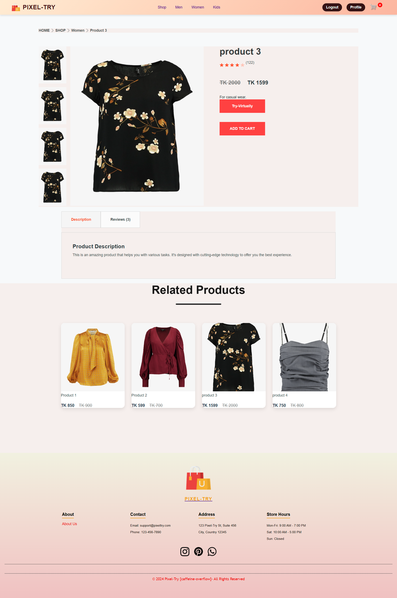
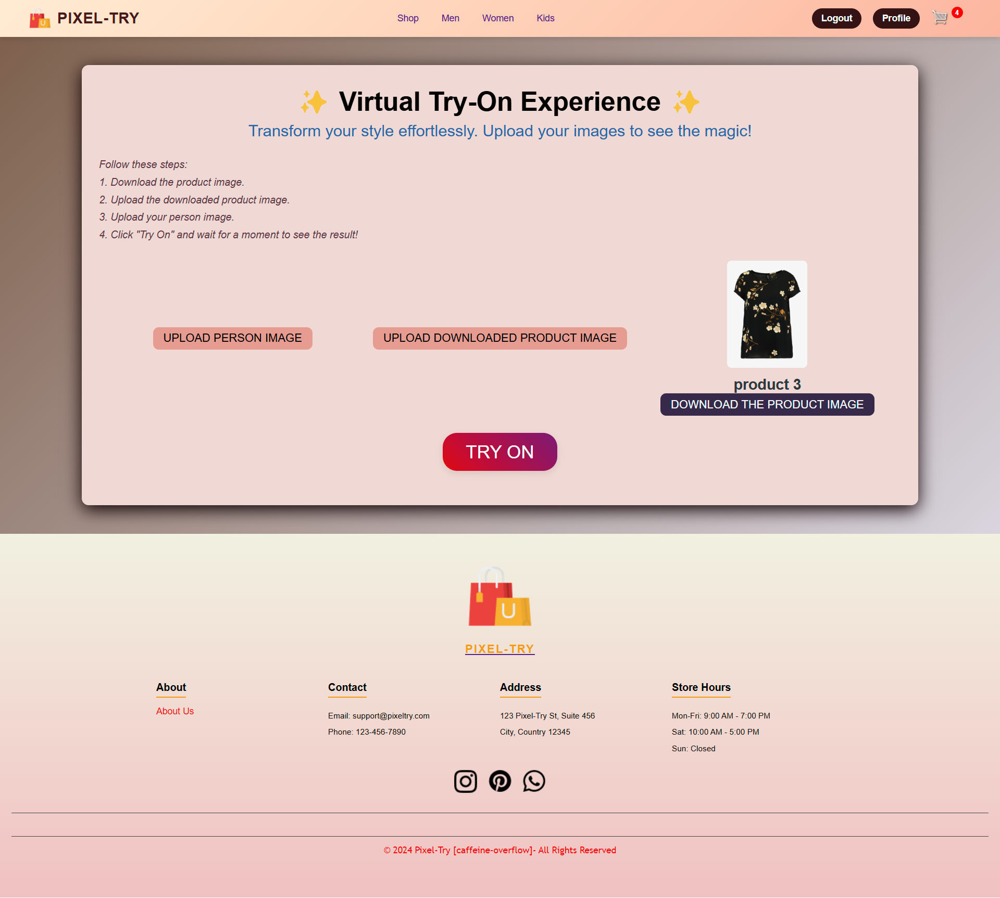
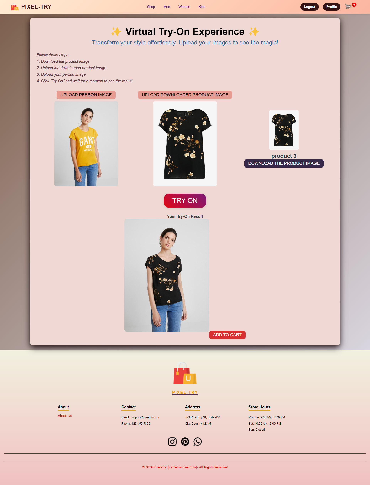

# Virtual Try-On in E-Commerce

## Overview

E-commerce is at the forefront of modern retail, offering unparalleled convenience to customers. Despite its rapid growth, certain limitations persist, particularly in the fashion sector.
A major pain point for customers is the lack of a tangible, visual sense of how clothing items
will fit or look on them. This issue results in reduced purchase confidence, high return rates,
and lower customer satisfaction. For retailers, the financial and environmental costs of processing returns are significant. The idea of virtual try-on systems arises from the need to bridge the
gap between the physical and digital shopping experiences. Leveraging artificial intelligence
(AI), computer vision, and AR technologies, VTO systems offer a practical solution by providing customers with a near-realistic visualization of how garments fit. The ability to simulate
clothing on the user’s body not only boosts customer confidence but also reduces return rates
and promotes sustainability in e-commerce

---

## Features

- **Virtual Try-On:** Upload a photo and try on clothing items virtually.
- **Product Integration:** Seamless connection between try-on and the e-commerce platform.
- **Interactive UI:** Easy-to-navigate interface built with React.js.
- **Backend Efficiency:** Scalable backend developed with Node.js and integrated with MongoDB.
- **Machine Learning:** Utilization of datasets like VITON-HD and DeepFashion2 for accurate predictions and rendering.

---

## Technologies Used

- **Frontend and Admin Section:** React.js
- **Backend:** Node.js, Express.js
- **Database:** MongoDB
- **Machine Learning Frameworks:** PyTorch, TensorFlow
- **Datasets:** VITON-HD, DeepFashion2, and custom datasets.

---

## Usage

### Try-On Feature

1. Upload an image or choose a sample model.
2. Select a clothing item from the catalog.
3. View the virtual try-on result.
4. Add the product to your cart.

---

## Screenshots

### Home Page


### Product Display page


### Virtual Try-On Interface (Before trail)


### Virtual Try-On Interface (After trail)



## Future Improvements

- Enhanced AR integration for mobile devices.
- AI-powered recommendations for users based on try-on data.
- Support for additional file formats and datasets.

---

## Setup Instructions

### Prerequisites

- Node.js (v16 or higher)
- MongoDB (v5.0 or higher)
- Python (v3.8 or higher)
- Git

### Installation Steps

1. Clone the repository:
   ```bash
   git clone https://github.com/Aporbo/Virtual-Try-On-in-Ecommerce.git
   ```

2. Navigate to the project directory:
   ```bash
   cd Virtual-Try-On-in-Ecommerce
   ```

3. Install dependencies for the backend:
   ```bash
   cd backend
   npm install
   ```

4. Install dependencies for the frontend:
   ```bash
   cd ../frontend
   npm install
   ```


5. Start the MongoDB server:
   ```bash
   mongod
   ```

6. Start the backend server:
   ```bash
   cd ../backend
   npm start
   ```

7. Start the frontend server:
   ```bash
   cd ../frontend
   npm start
   ```

8. Access the application at `http://localhost:3000`.

---

## Folder Structure

- `frontend/`: Contains the React.js code for the user interface.
- `Admin/`: Contains the React.js code for the Admin interface.
- `backend/`: Node.js application managing the API and database.
- `datasets/`: Includes datasets for machine learning and model training.
- `models/`: Pre-trained machine learning models.
- `scripts/`: Helper scripts for data preprocessing and model integration.

---


## License

This project is licensed under the MIT License. See the [LICENSE](LICENSE) file for details.

---
